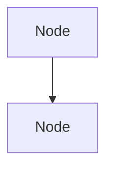

## Question Details

### Channel
- [ ] System Design
- [ ] Algorithms
- [ ] Frontend
- [ ] Database
- [ ] DevOps
- [ ] SRE

### Sub-Channel
Please specify the sub-channel (e.g., "infrastructure", "react", "sql", etc.)

### Difficulty Level
- [ ] Beginner
- [ ] Intermediate
- [ ] Advanced

## Question
Write the interview question here:

## Answer
Provide a concise answer (50-150 characters):

## Explanation
Provide a detailed explanation with markdown formatting:

## Diagram (Optional)
If applicable, provide a mermaid diagram:

## Tags
Suggest relevant tags (comma-separated):

## Related Topics
Are there any related questions or topics?

## Additional Context
Add any other context or references here.
