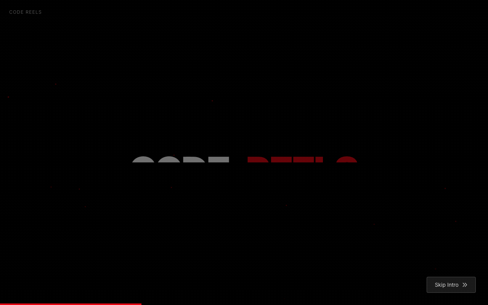

<p align="center">
  
</p>

<h1 align="center">🎬 Code Reels</h1>

<p align="center">
  <strong>Free technical interview prep that actually works</strong><br/>
  1000+ questions • 30+ topics • AI-powered learning
</p>

<p align="center">
  <a href="https://open-interview.github.io/">🚀 Try it now</a> •
  <a href="#features">Features</a> •
  <a href="#practice-modes">Practice Modes</a> •
  <a href="#getting-started">Get Started</a>
</p>

<p align="center">
  
  
  
  
</p>

---

## ✨ Features

| Feature | Description |
|---------|-------------|
| 📱 **Swipe Learning** | TikTok-style cards. One concept per swipe. |
| 🎤 **Voice Interview** | AI interviewer with real-time speech recognition |
| 🧠 **Spaced Repetition** | Science-backed SRS review scheduling |
| 🔍 **Semantic Search** | Vector DB powered similarity matching |
| 💻 **Coding Challenges** | In-browser editor with Python & JavaScript |
| 📝 **Channel Tests** | 20-question quizzes with adaptive difficulty |
| 🎓 **Certification Prep** | 25+ tracks (AWS, K8s, Terraform, Azure, GCP) |
| 🏆 **Gamification** | 50 levels, 40+ achievements, XP, streaks |
| 📊 **Adaptive Learning** | RAG-based personalized question selection |

<p align="center">
  
  
</p>

---

## 🎯 Practice Modes

### Swipe Learning
Browse questions like social media reels. Reveal answers with a tap. Track progress per channel.

### Voice Interview
Practice speaking your answers out loud. Real-time speech recognition tracks your words and auto-stops when you've covered the key points.

### Training Mode
Read & record answers with progressive reveal. Answers split into ~30 word segments for manageable practice.

### Channel Tests
20-question quizzes per topic with:
- RAG-based progressive question selection
- Adaptive difficulty based on performance
- Pass status that expires when new content is added
- Shareable badges on completion

### Certification Practice
Focused prep for 25+ industry certifications:

| Provider | Certifications |
|----------|---------------|
| **AWS** | SAA, SAP, DVA, SysOps, Security, Database, ML, Networking |
| **Kubernetes** | CKA, CKAD, CKS |
| **HashiCorp** | Terraform Associate |
| **Google Cloud** | ACE, PCA |
| **Microsoft** | AZ-900, AZ-104, AZ-305 |
| **CompTIA** | Security+, Linux+ |
| **Cisco** | CCNA |

### SRS Review Sessions
Spaced repetition reviews with 4-button rating (Again, Hard, Good, Easy). Questions resurface at optimal intervals.

---

## 🤖 AI Pipeline

Fully automated content generation and quality control:

```
┌─────────────────────────────────────────────────────────────────┐
│                    AI CONTENT PIPELINE                          │
├─────────────────────────────────────────────────────────────────┤
│                                                                 │
│  Creator Bot ──► Quality Gate ──► Vector DB ──► Live Content   │
│       │              │               │                          │
│       │         ┌────┴────┐    ┌─────┴─────┐                   │
│       │         │ Checks: │    │ Features: │                   │
│       │         │ • Dups  │    │ • Embed   │                   │
│       │         │ • Fit   │    │ • Search  │                   │
│       │         │ • Score │    │ • Similar │                   │
│       │         └─────────┘    └───────────┘                   │
│       │                                                         │
│       └──► Verifier Bot ──► Processor Bot ──► Improved Content │
│                                                                 │
└─────────────────────────────────────────────────────────────────┘
```

### Daily Automation
- **00:00 UTC** — Question generation bot
- **06:00 UTC** — Question improvement bot  
- **12:00 UTC** — Deduplication bot

### Vector Database (Qdrant)
| Operation | Use Case |
|-----------|----------|
| `vector:sync` | Index all questions |
| `vector:search` | Semantic search |
| `vector:duplicates` | Find near-duplicates |
| `vector:similar` | Pre-compute related questions |

---

## 🏗️ Architecture

```
├── client/                 # React 19 + TypeScript + Tailwind
│   ├── src/
│   │   ├── pages/         # 20+ route components
│   │   ├── components/    # Reusable UI (unified design system)
│   │   ├── hooks/         # Custom hooks (SRS, adaptive, voice)
│   │   ├── context/       # Achievement, credits, rewards, theme
│   │   └── lib/           # Utilities, configs, data loaders
│
├── script/                 # Build-time automation
│   ├── bots/              # Creator, verifier, processor, test builder
│   └── ai/                # LangGraph pipelines, vector services
│
└── server/                 # Express (dev only)
```

### Tech Stack

| Layer | Tech |
|-------|------|
| Frontend | React 19, Vite 7, Tailwind 4, Framer Motion |
| UI | Radix primitives, shadcn/ui components |
| Search | Pagefind (static), Qdrant (semantic) |
| AI | LangGraph, TF-IDF embeddings |
| Database | Turso (SQLite edge), Qdrant Cloud |
| Testing | Playwright E2E |
| Deploy | GitHub Pages (static) |

---

## 🚀 Getting Started

### Use Online
**[open-interview.github.io](https://open-interview.github.io/)** — No signup needed.

### Run Locally

```bash
git clone https://github.com/open-interview/open-interview.git
cd open-interview
pnpm install
pnpm dev
```

### Environment Setup

```bash
cp .env.example .env
```

Required for AI features:
```env
TURSO_DATABASE_URL=libsql://...
TURSO_AUTH_TOKEN=...
QDRANT_URL=https://...qdrant.io:6333
QDRANT_API_KEY=...
```

---

## 📦 Scripts

| Command | Description |
|---------|-------------|
| `pnpm dev` | Start dev server (port 5001) |
| `pnpm build:static` | Build for GitHub Pages |
| `pnpm test` | Run Playwright E2E tests |
| `pnpm vector:sync` | Sync questions to Qdrant |
| `pnpm bot:all` | Run all content bots |

---

## ⌨️ Keyboard Shortcuts

| Key | Action |
|-----|--------|
| `↑` `↓` | Navigate questions |
| `→` | Reveal answer |
| `Esc` | Go back |
| `Cmd+K` | Search |
| `T` | Toggle theme |

---

## 📊 Topics

| Category | Topics |
|----------|--------|
| 🏗️ Engineering | System Design, Algorithms, Frontend, Backend, Database |
| ☁️ Cloud | AWS, Kubernetes, Terraform, Docker, GCP, Azure |
| 🔒 Security | Security, Networking, Linux |
| 🤖 AI/ML | Machine Learning, Generative AI, Data Engineering |
| 🧪 Testing | Unit, E2E, API, Performance |
| 👥 Soft Skills | Behavioral, Engineering Management |

---

## 🤝 Contributing

PRs welcome! See [CONTRIBUTING.md](docs/CONTRIBUTING.md).

Areas of interest:
- New questions & topics
- UI/UX improvements
- AI pipeline enhancements
- Test coverage

---

## 📜 License

MIT — Use it however you want.

---

<p align="center">
  <strong>Built for devs, by devs 💜</strong><br/>
  <sub>Star us if this helped you prep!</sub>
</p>
