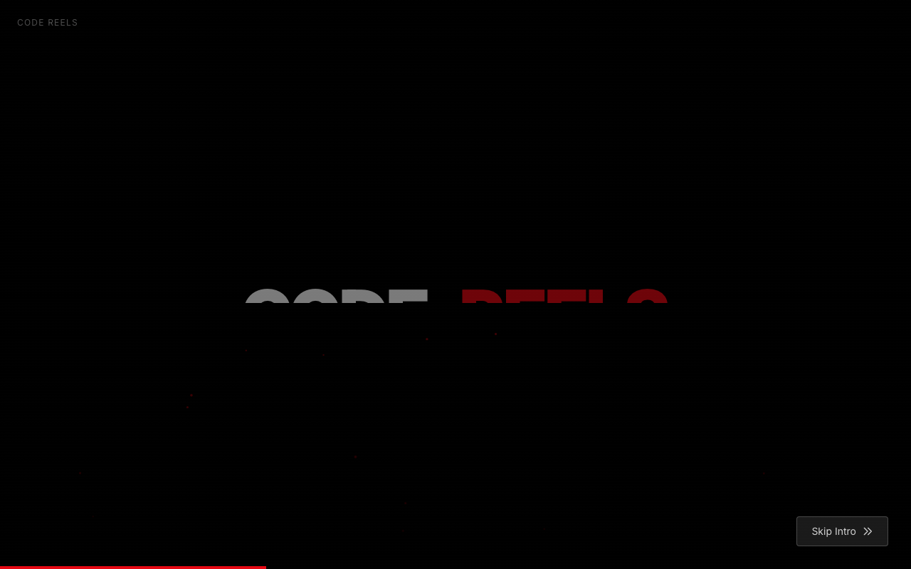
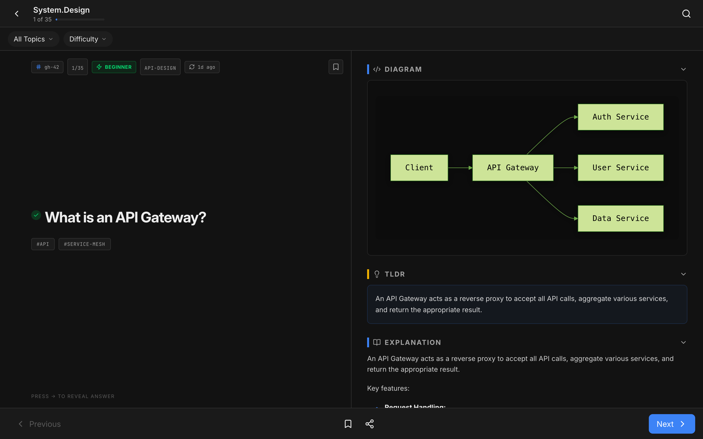
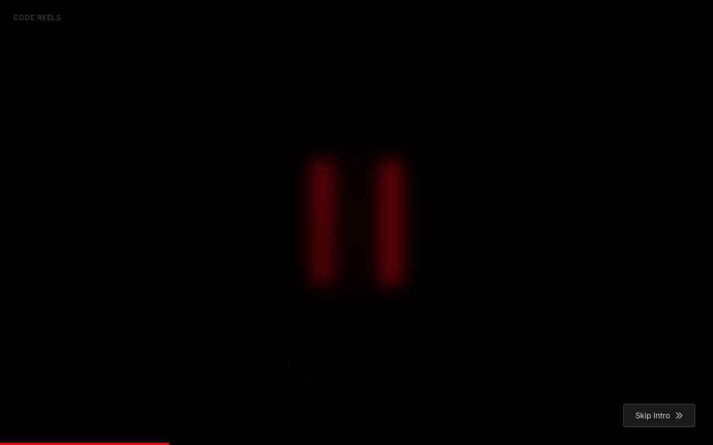
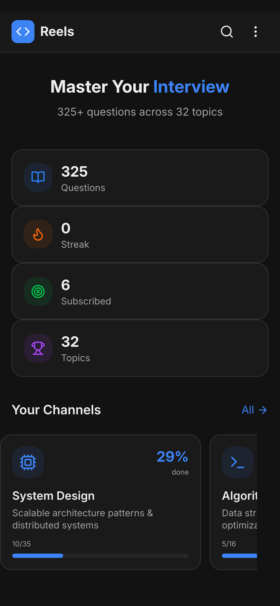
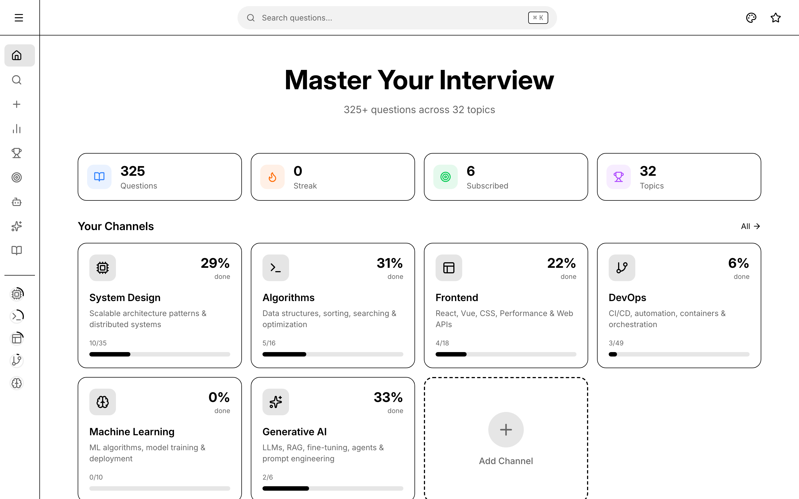

<p align="center">
  
</p>

<h1 align="center">🎬 Code Reels</h1>

<p align="center">
  <strong>Interview prep that actually slaps 🔥</strong><br/>
  Swipe through tech questions like TikTok, but make it ✨career growth✨
</p>

<p align="center">
  <a href="https://reel-interview.github.io/">🚀 Try it now</a> •
  <a href="#features">Features</a> •
  <a href="#screenshots">Screenshots</a> •
  <a href="#getting-started">Get Started</a>
</p>

<p align="center">
  
  
  
  
</p>

---

## 💭 The Problem

Traditional interview prep is **boring af**. Reading walls of text? Nah. Watching 3-hour YouTube videos? No thanks. 

We built Code Reels because we wanted interview prep that fits how we actually consume content — **quick, visual, and addictive**.

---

## ✨ Features

<table>
<tr>
<td width="50%">

### 📱 Swipe-Based Learning
Scroll through questions like your favorite social app. Each card = one concept. No fluff.

### 🎯 30+ Topics
System Design, Algorithms, Frontend, Backend, DevOps, AI/ML, Kubernetes, AWS... we got you.

### 🌙 Dark Mode (obvi)
Easy on the eyes for those late-night grind sessions.

</td>
<td width="50%">

### 📊 Track Your Progress
See your streaks, completion rates, and flex on your consistency.

### 🏆 Earn Badges
Gamified learning because dopamine hits > boring checkboxes.

### 🤖 AI-Powered Content
Fresh questions added daily by our AI bots. Always something new.

</td>
</tr>
</table>

---

## 📸 Screenshots

### Home Dashboard
Your personalized command center. Subscribe to channels that match your goals.

<p align="center">
  
</p>

### Question Reels
The main event. Swipe through questions, reveal answers, track progress.

<p align="center">
  
</p>

### All Channels
30+ topics organized by category. Pick your poison.

<p align="center">
  
</p>

### Stats & Progress
Data nerds, this one's for you. Track everything.

<p align="center">
  
</p>

### Mobile Experience
Looks fire on your phone too 📱

<p align="center">
  
  &nbsp;&nbsp;
  
</p>

### Light Mode
For the light mode enthusiasts (we don't judge... much 😏)

<p align="center">
  
</p>

---

## 🎮 Topics We Cover

| Category | Topics |
|----------|--------|
| 🏗️ **Engineering** | System Design, Algorithms, Frontend, Backend, Database |
| ☁️ **Cloud & DevOps** | AWS, Kubernetes, Terraform, DevOps, SRE |
| 🤖 **AI & ML** | Machine Learning, Generative AI, LLMOps, NLP, Computer Vision |
| 📱 **Mobile** | iOS, Android, React Native |
| 🔒 **Security** | Application Security, Networking |
| 🧪 **Testing** | Unit Testing, E2E Testing, API Testing, Performance Testing |
| 👥 **Soft Skills** | Behavioral, Engineering Management |

---

## 🚀 Getting Started

### Use it Online (Easiest)
Just go to **[reel-interview.github.io](https://reel-interview.github.io/)** and start swiping. No signup needed.

### Run Locally

```bash
# Clone it
git clone https://github.com/satishkumar-dhule/code-reels.git
cd code-reels

# Install deps
pnpm install

# Run it
pnpm dev
```

Open [localhost:5001](http://localhost:5001) and you're golden ✨

---

## ⌨️ Keyboard Shortcuts

For the keyboard warriors:

| Key | Action |
|-----|--------|
| `↑` `↓` | Previous / Next question |
| `→` | Reveal answer |
| `←` `Esc` | Go back |
| `T` | Toggle theme |

---

## 🤖 AI-Powered Content

Our bots work 24/7 so you don't have to:

- **Daily Question Bot** — Adds 5 fresh questions every day
- **Improvement Bot** — Enhances existing content with better explanations
- **Deduplication Bot** — Keeps the question bank clean

All powered by AI. All automatic. All free.

---

## 🛠️ Tech Stack

Built with the good stuff:

- **Frontend**: React 19, TypeScript, Tailwind CSS, Framer Motion
- **Backend**: Express.js, Drizzle ORM
- **Database**: Turso (SQLite edge)
- **Diagrams**: Mermaid.js
- **Testing**: Playwright
- **CI/CD**: GitHub Actions

---

## 🤝 Contributing

PRs welcome! Whether it's:
- Adding new questions
- Fixing bugs
- Improving UI/UX
- Adding new features

Check out [CONTRIBUTING.md](CONTRIBUTING.md) for the deets.

---

## 📜 License

MIT — do whatever you want with it.

---

<p align="center">
  <strong>Built for devs, by devs 💜</strong><br/>
  <sub>If this helped you land that job, drop us a ⭐</sub>
</p>

<p align="center">
  <a href="https://github.com/satishkumar-dhule/code-reels">
    
  </a>
</p>
