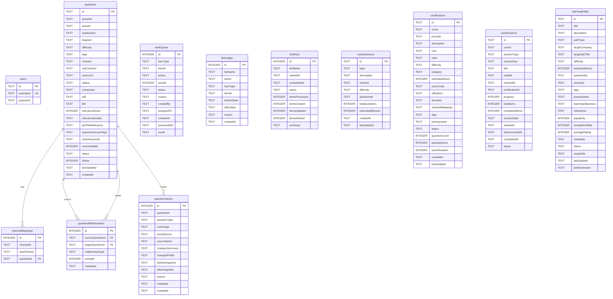
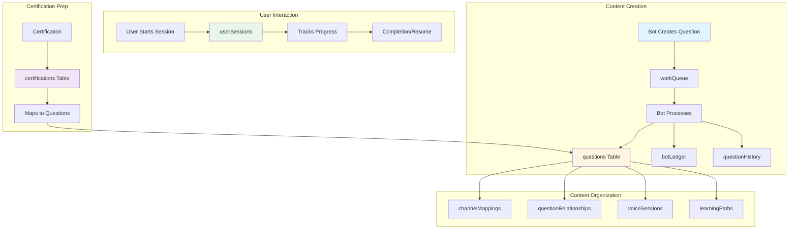

# Turso Database Schema Diagram

## Entity Relationship Diagram



## Table Categories

### 🔐 Authentication & Users
- **users**: User accounts and authentication

### 📚 Core Content
- **questions**: Interview questions with enriched metadata
- **channelMappings**: Question-to-channel relationships
- **certifications**: Certification tracks and exam info
- **learningPaths**: Curated learning paths

### 🤖 Bot Management
- **workQueue**: Task queue for bot coordination
- **botLedger**: Audit log of all bot actions
- **botRuns**: Bot execution history and stats

### 🔗 Relationships & Sessions
- **questionRelationships**: Links between related questions
- **voiceSessions**: Pre-built voice interview sessions
- **userSessions**: Active user session tracking
- **questionHistory**: Complete change history

## Data Flow Diagram



## Schema Statistics

### Table Sizes (Estimated)

| Table | Estimated Rows | Growth Rate | Storage Impact |
|-------|---------------|-------------|----------------|
| questions | 1,000+ | Medium | High |
| questionHistory | 10,000+ | High | High |
| channelMappings | 2,000+ | Medium | Low |
| certifications | 50+ | Low | Low |
| learningPaths | 100+ | Medium | Medium |
| voiceSessions | 200+ | Medium | Low |
| userSessions | 1,000+ | High | Medium |
| workQueue | 100+ | High (transient) | Low |
| botLedger | 50,000+ | Very High | High |
| botRuns | 1,000+ | Medium | Low |
| questionRelationships | 5,000+ | Medium | Low |
| users | 100+ | Low | Low |

### JSON Field Complexity

| Table | JSON Fields | Complexity | Index Needed |
|-------|-------------|------------|--------------|
| questions | 8 fields | High | Yes (tags, channel) |
| certifications | 5 fields | Medium | Yes (tags) |
| learningPaths | 7 fields | High | Yes (tags, channels) |
| voiceSessions | 1 field | Low | No |
| workQueue | 1 field | Low | No |
| botLedger | 2 fields | Medium | No |

## Access Patterns

### High-Frequency Queries

1. **Get Questions by Channel**
   ```sql
   SELECT * FROM questions 
   WHERE channel = ? AND status = 'active'
   ORDER BY createdAt DESC
   ```

2. **Get Active User Sessions**
   ```sql
   SELECT * FROM userSessions 
   WHERE status = 'active' 
   ORDER BY lastAccessedAt DESC
   ```

3. **Get Certification Questions**
   ```sql
   SELECT q.* FROM questions q
   JOIN channelMappings cm ON q.id = cm.questionId
   WHERE cm.channelId = ? AND q.status = 'active'
   ```

4. **Get Learning Path Details**
   ```sql
   SELECT * FROM learningPaths 
   WHERE status = 'active' AND pathType = ?
   ORDER BY popularity DESC
   ```

### Medium-Frequency Queries

1. **Get Question History**
   ```sql
   SELECT * FROM questionHistory 
   WHERE questionId = ? 
   ORDER BY createdAt DESC
   ```

2. **Get Related Questions**
   ```sql
   SELECT q.* FROM questions q
   JOIN questionRelationships qr ON q.id = qr.targetQuestionId
   WHERE qr.sourceQuestionId = ?
   ORDER BY qr.strength DESC
   ```

3. **Get Bot Activity**
   ```sql
   SELECT * FROM botLedger 
   WHERE botName = ? 
   ORDER BY createdAt DESC 
   LIMIT 100
   ```

### Low-Frequency Queries

1. **Get Work Queue Items**
   ```sql
   SELECT * FROM workQueue 
   WHERE status = 'pending' 
   ORDER BY priority ASC, createdAt ASC
   ```

2. **Get Bot Run Statistics**
   ```sql
   SELECT * FROM botRuns 
   WHERE botName = ? AND status = 'completed'
   ORDER BY startedAt DESC
   ```

## Indexing Strategy

### Recommended Indexes

```sql
-- Questions table
CREATE INDEX idx_questions_channel ON questions(channel);
CREATE INDEX idx_questions_status ON questions(status);
CREATE INDEX idx_questions_difficulty ON questions(difficulty);
CREATE INDEX idx_questions_created ON questions(createdAt);

-- Channel mappings
CREATE INDEX idx_channel_mappings_channel ON channelMappings(channelId);
CREATE INDEX idx_channel_mappings_question ON channelMappings(questionId);

-- Question history
CREATE INDEX idx_question_history_question ON questionHistory(questionId);
CREATE INDEX idx_question_history_type ON questionHistory(questionType);

-- User sessions
CREATE INDEX idx_user_sessions_status ON userSessions(status);
CREATE INDEX idx_user_sessions_type ON userSessions(sessionType);
CREATE INDEX idx_user_sessions_key ON userSessions(sessionKey);

-- Work queue
CREATE INDEX idx_work_queue_status ON workQueue(status);
CREATE INDEX idx_work_queue_priority ON workQueue(priority);

-- Bot ledger
CREATE INDEX idx_bot_ledger_bot ON botLedger(botName);
CREATE INDEX idx_bot_ledger_item ON botLedger(itemId);

-- Learning paths
CREATE INDEX idx_learning_paths_type ON learningPaths(pathType);
CREATE INDEX idx_learning_paths_status ON learningPaths(status);
```

## Migration Strategy

### Phase 1: Core Tables
1. users
2. questions
3. channelMappings

### Phase 2: Bot Infrastructure
1. workQueue
2. botLedger
3. botRuns

### Phase 3: Relationships
1. questionRelationships
2. questionHistory

### Phase 4: Advanced Features
1. voiceSessions
2. certifications
3. userSessions
4. learningPaths

## Backup Strategy

### Daily Backups
- Full database dump
- Store in cloud storage (S3, GCS)
- Retain for 30 days

### Weekly Backups
- Full database dump
- Store in cold storage
- Retain for 1 year

### Critical Tables (Real-time Replication)
- questions
- users
- certifications
- learningPaths

## Monitoring Metrics

### Key Metrics to Track

1. **Table Growth Rate**
   - questions: +50/week
   - questionHistory: +500/week
   - botLedger: +1000/week

2. **Query Performance**
   - Average query time < 50ms
   - P95 query time < 200ms
   - P99 query time < 500ms

3. **Storage Usage**
   - Total database size
   - Growth rate per month
   - JSON field sizes

4. **Bot Activity**
   - Bot runs per day
   - Success/failure rate
   - Processing time

---

**Generated**: January 25, 2026
**Schema Version**: 2.2.0
